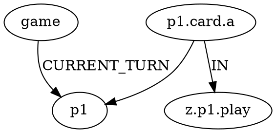

# Architecture

Graph-based game state engine with filesystem persistence. Designed for game tree exploration, replay, and ML training data generation.

## Core Concepts

### Game State as Directed Graph

Game state represented as a **NetworkX MultiDiGraph**, serialized to DOT format.

**Nodes** represent game entities:
- Game metadata (turn counter)
- Players (score, resources)
- Zones (locations: hand, board, deck, discard)
- Card instances (dynamic, created on-demand)

**Edges** represent relationships and legal actions:
- **Structural**: `CURRENT_TURN`, `OWNS`, `IN` (card location)
- **Legal actions**: `CAN_PASS`, `CAN_INK`, `CAN_PLAY`, `CAN_QUEST`, etc.

Legal action edges are **computed from game rules** and stored on the graph, making the state self-documenting.

### Filesystem as Game Tree

```
output/<matchup-hash>/<shuffle-seed>/<action>/<action>/...
                                     └─ sequential action IDs (0, 1, 2...)
```

**Each directory = one game state**:
- `game.dot` - Complete graph (nodes + edges)
- `path.txt` - History of actions taken to reach this state
- `actions.txt` - Available actions from this state
- `deck1.dek`, `deck2.dek` - Remaining cards not yet drawn

**Tree structure**:
- Root: initial game state after shuffle
- Branches: alternate move sequences
- Leaves: games in progress (explored but not continued)

### Lazy State Computation

States only exist when explored:
1. Navigate to `output/.../0/1/2/`
2. If `game.dot` doesn't exist → load parent, apply action, save result
3. Recursive: automatically builds missing parent states

**Benefits**:
- Sparse storage (only explored paths)
- Parallel exploration (each state independent)
- Natural caching (once computed, reused)

### Deterministic Replay

**Matchup hash**: MD5 of deck contents → same decks = same hash
**Shuffle seed**: Hand specification (which cards go to each player) + RNG seed
**Action sequence**: Sequential indices, deterministically sorted

`same decks + same seed + same actions = identical game state`

Perfect for:
- Reproducible experiments
- Bug reports with exact game state
- Training data with consistent labeling

## Data Structures

### Node Schema

| type     | attributes                                       |
| -------- | ------------------------------------------------ |
| `Game`   | `turn`: int                                      |
| `Player` | `lore`: int, `ink_drops`: int, `ink_total`: int  |
| `Zone`   | `kind`: {hand, deck, play, inkwell, discard}     |
| `Step`   | `player`: {p1, p2}, `step`: {ready, set, draw, main, end} |
| `Card`   | `card_id`, `label`, `tapped`, `entered_play`     |

Card nodes created **lazily** when drawn from deck.

**Phase nodes** (10 total: `step.p1.ready` through `step.p2.end`) represent turn structure. Temporal effects can point to phase nodes to specify duration ("until end of turn" → UNTIL edge to `step.p1.end`).

### Edge Schema

**Structural**:
- `CURRENT_TURN`: Game → Player (whose turn)
- `CURRENT_STEP`: Game → Step (current phase: ready/set/draw/main/end)
- `OWNS`: Zone → Player (ownership)
- `IN`: Card → Zone (location)

**Action** (computed by rules engine):
- `CAN_PASS`: Player → Game
- `CAN_INK`: Card → Zone
- `CAN_PLAY`: Card → Zone
- `CAN_QUEST`: Card → Player
- Each edge has attributes: `action_type`, `action_id`

### Action IDs

Sequential integers (0, 1, 2...) assigned deterministically:
1. Collect all legal actions
2. Sort by `(action_type, from_node, to_node)`
3. Enumerate → assign indices

**Properties**:
- No collisions
- Stable across runs (deterministic sort)
- Easy indexing for ML (`actions[0]`, `actions[1]`)

### File Formats

**game.dot** (DOT/Graphviz):


**path.txt** (human-readable history):
```
0: ink:p1.card_a
1: play:p1.card_b
0: end
```

**actions.txt** (available moves):
```
0: ink:p1.card_c
1: end
2: quest:p1.card_b
```

**deck.dek** (flat file, cards not yet drawn):
```
card_name_1.a
card_name_2.b
...
```

## State Lifecycle

```
1. Initialize (match)
   ├─ Load template graph (zones, players)
   ├─ Hash deck contents → matchup ID
   └─ Save: output/<hash>/game.dot

2. Shuffle (deterministic)
   ├─ Parse seed → which cards go to each hand
   ├─ Shuffle remaining deck
   ├─ Draw cards → create card nodes
   ├─ Compute legal actions → add CAN_* edges
   └─ Save: output/<hash>/<seed>/game.dot, *.dek

3. Play (on-demand)
   ├─ If game.dot exists → load and display
   ├─ Else: load parent, apply action, save
   ├─ Compute legal actions for new state
   ├─ Write path.txt (parent's path + this action)
   └─ Write actions.txt (formatted legal actions)
```

## ML/AI Research Questions

This system was designed to support ML/AI research. Here are hypotheses to explore:

### Hypothesis: Systematic Game Tree Exploration
- Can we generate diverse training data by systematically exploring the game tree?
- What strategies (BFS, DFS, random walk) produce the most valuable training samples?
- How many unique game states exist within N turns?

### Hypothesis: State Space Characterization
- What is the actual branching factor at different game phases?
- How does state space grow with turn count?
- Are there common game patterns (opening sequences, endgame states)?

### Hypothesis: Reproducibility Enables Learning
- Does deterministic replay allow for controlled experiments?
- Can we A/B test strategies by replaying from decision points?
- How valuable is exact state reconstruction for debugging agents?

### Hypothesis: Graph Features Predict Outcomes
- Which graph properties correlate with winning?
- Can we extract features directly from DOT files?
- Example features to test:
  ```python
  import networkx as nx
  G = nx.drawing.nx_pydot.read_dot("game.dot")

  # Feature candidates
  turn = int(G.nodes['game']['turn'])
  p1_lore = int(G.nodes['p1']['lore'])
  cards_in_hand = [u for u,v,d in G.edges(data=True)
                   if d.get('label') == 'IN' and v == 'z.p1.hand']
  ```

**Status**: Infrastructure exists. Experiments needed to validate hypotheses.

## Extension Points

### Adding New Mechanics

1. Create `lib/lorcana/mechanics/mechanic_name.py`:
   - `compute_can_X(G)` → list of legal action edges
   - `execute_X(state, from, to)` → mutate state graph

2. Register in `lib/lorcana/compute.py`:
   ```python
   edges_to_add.extend(compute_can_X(G))
   ```

3. Register in `lib/lorcana/execute.py`:
   ```python
   elif action_type == "CAN_X":
       execute_X(state, from_node, to_node)
   ```

Sequential action IDs assigned automatically.

### Custom Analysis Tools

All data accessible via standard tools:
- `find`, `grep` for filesystem queries
- NetworkX for graph analysis
- Shell scripts for batch processing
- DOT files viewable with Graphviz

### API/Programmatic Access

```python
from lib.lorcana.state import LorcanaState

# Load any game state
state = LorcanaState("output/b013/seed/0/1/2")
state.load()

# Query graph
cards_in_play = [n for n in state.graph.nodes()
                 if state.graph.nodes[n].get('type') == 'Card']

# Apply actions programmatically
from lib.lorcana.execute import execute_action
execute_action(state, "CAN_PLAY", "p1.card.a", "z.p1.play")
state.save()
```

## Performance Characteristics

**To be measured**. Initial observations:
- State size appears to be a few KB per game.dot
- Computation is fast enough for interactive exploration
- Storage is sparse (only explored paths exist)

**Known scalability properties**:
- ✅ Parallel exploration possible (independent states)
- ✅ Distributed analysis possible (filesystem-based)
- ✅ Incremental computation (lazy state creation)
- ⚠️ Potential limits: filesystem inodes, path length

Proper benchmarking needed before making claims.

## Design Principles

1. **Graph = source of truth**: Everything derivable from game.dot
2. **Filesystem = interface**: Standard tools work (ls, grep, diff)
3. **Lazy = efficient**: Only compute what you explore
4. **Deterministic = reproducible**: Same inputs → same outputs
5. **Self-documenting**: State includes metadata (path.txt, actions.txt)
6. **Composable**: Unix philosophy, pipe-friendly
